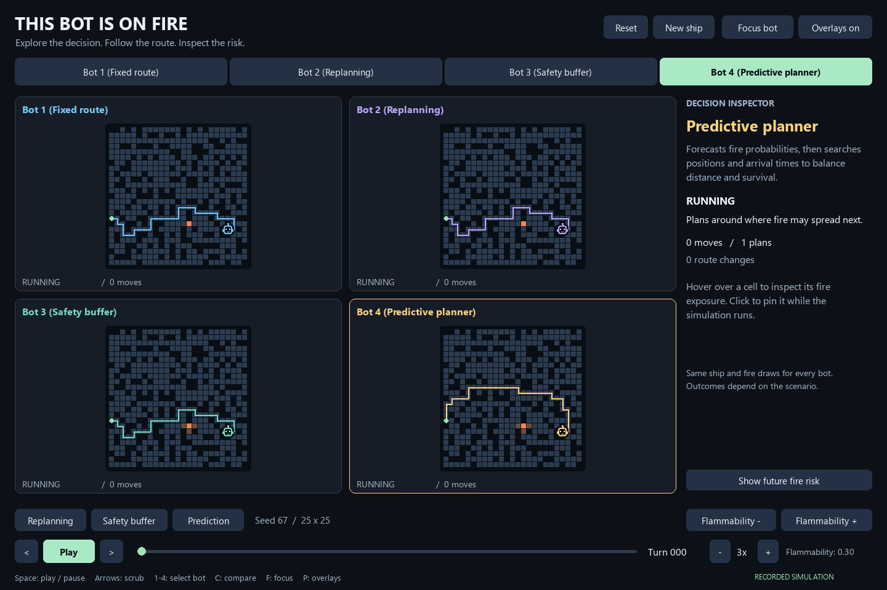
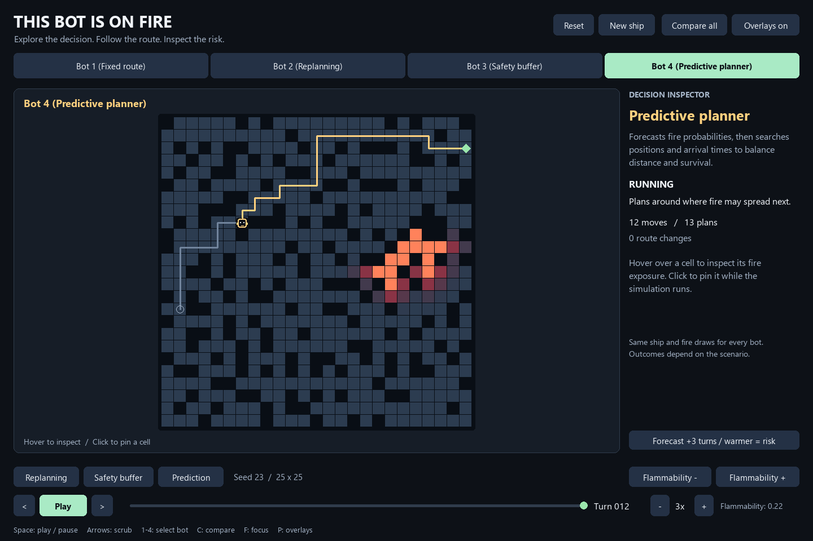

# This Bot Is on Fire

## The problem

A robot must navigate a burning spaceship and reach a button that shuts down the fire. It can move one cell per turn, but the fire spreads after each move. **The shortest route at the start may become dangerous before the robot reaches the button.**

The challenge is to build an agent that can respond to changing conditions and choose a route that keeps it alive. This Python application compares four approaches: follow a fixed path, replan as fire spreads, maintain a safety buffer, and predict future danger.

## Watch the four approaches

Each panel below runs a different bot on the same ship, with the same starting positions and random fire draws. The robot icon is the moving agent, orange cells are fire, and the green diamond is the target button.



**In this example:** Bot 1 fails at move **10**. Bot 2 adapts and survives longer, but fails at **33**. Bot 3 reaches the button in **51 moves**; Bot 4 anticipates danger and succeeds in **49 moves**.

*Reproduce this run: 25 x 25 grid, seed 67, flammability 0.30. This is an illustrative scenario, not a guarantee of the same ranking on every ship.*

## Why apply AI to pathfinding?

This project demonstrates how an agent can **use search to find actions, observations to revise them, and a model of the environment to anticipate their consequences**. These ideas apply to robot navigation and route planning when conditions change. Here, they are explored in an interactive simulation.

The intelligence comes from how each agent uses information around its search algorithm. This is **classical AI: search, planning, constraints, and reasoning under uncertainty**. It does not require a neural network or training data.

## Making basic search more intelligent

BFS finds a shortest path in an unweighted grid. DFS can find a path, but does not generally find the shortest one. Neither algorithm inherently fails: the weakness is **planning once from a snapshot and assuming the world will stay unchanged**.

| Bot | Information it uses | What makes the approach more informed? |
| --- | --- | --- |
| **Bot 1 (Fixed route)** | Initial map and fire | Establishes a shortest-path baseline. |
| **Bot 2 (Replanning)** | Updated fire after every move | Adds feedback: revise the plan when the world changes. |
| **Bot 3 (Safety buffer)** | Current fire and neighboring cells | Adds a safety rule: avoid immediate exposure before those cells ignite. |
| **Bot 4 (Predictive planner)** | Estimated future fire and arrival times | Adds prediction: evaluate how risky a cell may be when the bot actually reaches it. |

In the implementation, Bots 1-3 use uniform-cost search with equal movement costs, giving the same shortest-path length as BFS. DFS is a conceptual baseline, not an implemented bot. Bot 4 combines a reverse BFS with predictive A* search.

### Bot 1: search once, follow the plan

The bot finds a shortest route around the initial fire and commits to it. It does not change that route as the fire spreads. The search solves the initial map correctly, but its assumptions become outdated during execution.

**What is missing:** awareness that the environment changes. In the GIF, the original route leads into fire at move 10.

### Bot 2: observe, replan, move

After every fire update, the bot computes a new shortest safe route and takes its next step. This turns a one-time search into a feedback loop: **observe the current state → plan → act → observe again**.

**What improves over Bot 1:** the bot can abandon a blocked route instead of blindly following it. However, it still considers safety only on the current map. Fire can spread into its next position after it moves. In the GIF, it survives until move 33.

### Bot 3: add a safety constraint

Before searching, the bot temporarily excludes both burning cells and cells adjacent to fire. If no buffered route exists, it falls back to Bot 2's shortest-safe-route rule. This mask never changes the actual fire map.

**What improves over Bot 2:** the bot uses a simple model of danger to avoid immediate exposure, rather than waiting for a cell to burn. The trade-off is that a fixed buffer can cause detours and does not account for how quickly fire will spread. In the GIF, it survives, taking 51 moves.

### Bot 4: predict danger at the time of arrival

The bot estimates future fire probabilities from the observed fire, flammability, and spreading rules. It then uses risk-weighted A* to search **(cell, arrival time)** states. A cell reached two turns from now and the same cell reached ten turns from now can have different risks.

**What improves over Bot 3:** safety becomes a time-dependent estimate instead of a fixed exclusion zone. The planner balances distance against estimated exposure, executes one move, and recomputes its predictions from the next observation. In this GIF, it reaches the button in 49 moves, two fewer than Bot 3.

These are increasingly informed policies, not a guarantee that each bot wins more often on every scenario. Bot 4 has an approximate model and a bounded planning horizon; it cannot know the future random fire outcomes.

## Explore the decisions



Select **Bot 1-4**, switch between **Focus** and **Compare**, and hover over a cell to inspect its exposure. Click to pin a cell, pause the simulation, step backward, or drag the timeline to revisit a decision.

Bot 4's **future fire risk** overlay cycles through estimates for three and six turns ahead; warmer cells mean greater estimated risk. The inspector's next-spread probability comes directly from the currently burning neighbors. Neither view reveals future random draws.

The **Replanning**, **Safety buffer**, and **Prediction** buttons load illustrative scenarios; they do not select bots. **Flammability - / +** changes how easily fire spreads and restarts the scenario. The GIF is a recording; launch the app for interactive controls.

## Run the application

Use Python 3.10-3.13 from the repository root:

```bash
python -m pip install -r requirements.txt
python main.py
```

Run or export the exact README scenario:

```bash
python main.py --size 25 --q 0.3 --seed 67
python main.py --size 25 --q 0.3 --seed 67 --export output/demo.gif
```

Use `--size 40` for the assignment's target grid size. Export creates a GIF and a full-color PNG preview, stops when all bots finish or `--max-steps` is reached (default: 180), and reports truncation. It overwrites the specified GIF and matching PNG.

| Control | Action |
| --- | --- |
| `Space` | Play / pause; replay a completed run |
| Left / right arrows | Step backward / forward |
| `1`-`4` | Select a bot |
| `C` / `F` | Compare / focus |
| `R` / `N` | Reset / new ship |
| `[` / `]` | Decrease / increase flammability |
| `-` / `=` | Slower / faster playback |
| `P` | Toggle route, trail, and adjacent-fire overlays |
| `Esc` | Clear a pinned cell, or exit |

## Simulation rules and fair comparison

The ship grows from an interior open cell. Generation repeatedly opens a randomly chosen blocked cell with exactly one open neighbor, then selects half the original dead ends for an extra opening. Bot, button, and fire start in three distinct open cells. Movement is orthogonal; walls never burn.

Each turn follows this order:

1. Choose a move and move once.
2. Fail if the bot enters existing fire.
3. Succeed if it reaches the unburned button; suppress fire immediately.
4. Otherwise, spread fire simultaneously from the previous fire state.
5. Check whether the bot or button burned, and prepare the next plan.

A non-burning open cell with `K` burning neighbors ignites with probability **`1 - (1 - q)^K`**, where `q` is flammability. Fire persists until suppression. A burned button or lack of a current-safe route cannot recover.

Each bot runs independently with the same initial conditions and a separate identically seeded random generator. Every fire update draws a full grid of random values, so search operations cannot shift the fire stream. Completed panels freeze; a successful bot suppresses fire only in its own panel.

Bot 3 may leave its current cell even if it is fire-adjacent, but its buffered plan cannot enter other adjacent-fire cells, including the goal. If that restriction prevents a route, it falls back to ordinary safe search.

<details>
<summary><strong>Bot 4: prediction model and search details</strong></summary>

The dashboard replaces the original goal-distance/fire-distance heuristic with predictive planning. The original Bot 4 remains in the legacy folder for reference.

Starting from the observed fire map, `p_0`, the forecast is:

```text
p_(t+1)(x) = 1 - (1 - p_t(x)) * product(1 - q * p_t(neighbor))
```

Wall probabilities stay zero. This assumes independence between neighboring fire events and is an approximation, not an exact joint probability model.

Search states contain both cell and arrival time. Each move costs:

```text
1 + 12 * -log(1 - estimated_fire_probability_at_arrival)
```

The first term penalizes travel; the second penalizes exposure. The weight 12 is an explicit heuristic choice, not a learned or universally optimal value. The implementation clamps survival probability to at least `1e-12` before taking the logarithm and skips states with estimated fire probability 1.

The goal uses the probability before that turn's spread because pressing the button happens first. Current burning cells are never traversable. Reverse BFS supplies a shortest-distance lower bound to guide A* and prune states that cannot reach the goal within the horizon.

The horizon is the current shortest distance plus `max(16, shortest_distance // 2)` turns. Only the next action is executed; the bot forecasts and searches again after the next fire update. If no forecast route is found within this bound, it falls back to a current-safe shortest route. Longer detours outside the horizon and correlations omitted by the forecast limit the planner.

</details>

<details>
<summary><strong>Engineering, original code review, and fixes</strong></summary>

All original tracked Python files, package initializers, dependencies, and README were reviewed.

| Area | Original issue | Current implementation |
| --- | --- | --- |
| `main.py` | Launched only Bot 1; experiment loops were commented out. | Validated CLI, four bots, interactive views, and export. |
| Dependencies / README | Undeclared Matplotlib import; one-line README. | Main/legacy requirements and this consolidated guide. |
| `ship.py` | Boundary starts, repeated rescans, potentially exhausted dead-end list. | Interior start, candidate set, bounded dead-end selection. |
| `utilities.py` | Start marker excluded from traversability. | Terrain stored separately from display state. |
| `visualizer.py` | Import-time figure; no distinct moving agent or future route. | Robot markers, route overlays, focus and comparison views. |
| Bot 1 | Extra initial wait; delayed collision checks. | One move per turn and immediate collision detection. |
| Bot 2 | Replanned only when its existing route contained fire. | Replans every turn, as specified in the assignment. |
| Bot 3 | Used real fire markers to test a buffer, corrupting environment state. | Temporary search mask and explicit fallback. |
| Original Bot 4 | Distance-only risk omitted arrival time; filtering a heap could break ordering. | Fire forecasts, cell/time states, valid heap operations, and stale-entry checks. |
| Shared runner behavior | Duplicated turn logic, time-based seeds, mutable yielded frames. | One simulation engine, reproducible streams, terminal states, and replay snapshots. |

Legacy runners retain their original limitations and are not used by the dashboard. Obsolete commented-out code was removed without changing their executable behavior. Install `requirements-legacy.txt` only to use their additional dependencies.

The UI draws text and geometry at the current window resolution instead of stretching a pre-rendered bitmap. It prefers Segoe UI, then Inter, DejaVu Sans, or Arial; fonts can differ by operating system. Integer grid spacing keeps edges sharp. The application and moving agents use robot icons.

Rewind stores complete snapshots, so moving forward again preserves the same outcomes. Changing flammability or scenario resets the timeline. Plan counts include initialization; route-change counts compare a new plan with the remaining previous route. GIFs use 256 colors; PNG previews retain full RGB color.

```text
main.py                 CLI entry point
modules/simulation.py   Shared rules and four strategies
modules/dashboard.py    Interactive Pygame UI and export
modules/bots/           Original bot implementations (legacy)
modules/ship/           Original ship helpers and view (legacy)
tests/                  Simulation and UI regression checks
docs/media/             GIF, screenshots, and application icon
```

</details>

<details>
<summary><strong>Verification, evidence, and assignment scope</strong></summary>

```bash
python -m unittest discover -s tests -v
```

Simulation checks cover connected generation, distinct and matched placements, q=0 and q=1 behavior, synchronous spread, success before spread, post-spread death, fixed-route collisions, per-turn replanning, non-mutating buffers and fallback, replay consistency, shared fire streams, wall-aware forecasts, and planning without consuming future randomness.

UI checks cover native-size mouse coordinates, keyboard events, focus/compare selection, pinned cells, rewind consistency, timeline scrubbing, replay, and GIF decoding. Previews are visually inspected. Off-screen checks do not guarantee identical appearance on every operating system.

A bounded smoke comparison used 120 matched scenarios: 25 x 25 grids, seeds 0-39, flammability values 0.1/0.3/0.5, and a 180-turn cap. Success counts were **98, 100, 100, and 101** for Bots 1-4. This small difference does not establish statistically significant or universal superiority. The headline GIF is a selected, reproducible illustration of the four policies.

This project was developed for Rutgers **16:198:520, Introduction to Artificial Intelligence**.

</details>

Built with **Python, NumPy, Pygame, and Pillow**.
